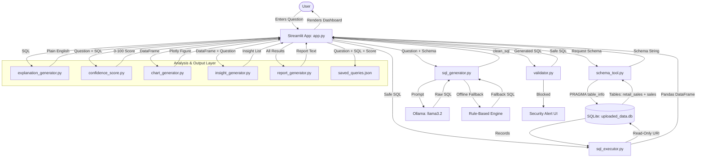

# System Architecture

The **NL-To-SQL Analytics Agent** translates natural language questions into safe SQL queries, executes them against an SQLite database, and delivers results through data tables, Plotly visualizations, AI-generated insights, and exportable reports.

---

## Architecture Flow



---

## Database Schema

Both tables live inside `database/uploaded_data.db`:

### `retail_sales` — 1,000 rows (primary dataset)
| Column | Type | Description |
|---|---|---|
| transaction_id | INTEGER PK | Unique transaction identifier |
| date | TEXT | Transaction date (YYYY-MM-DD) |
| customer_id | TEXT | Customer reference code |
| gender | TEXT | Male / Female |
| age | INTEGER | Customer age |
| product_category | TEXT | Beauty / Clothing / Electronics |
| quantity | INTEGER | Units purchased |
| price_per_unit | REAL | Unit price |
| total_amount | REAL | Total transaction value |

### `sales` — 35 rows (legacy dataset)
| Column | Type | Description |
|---|---|---|
| order_id | INTEGER PK | Order identifier |
| product | TEXT | Product name |
| category | TEXT | Product category |
| region | TEXT | Sales region |
| sales | REAL | Sale amount |
| date | TEXT | Order date |

---

## Component Details

### 1. Interface Layer (`app.py`)
Full Streamlit dashboard implementing the 11-stage sequential output flow:
- Welcome hero screen
- AI Understanding stage with live status indicators
- Generated SQL display
- Validation checklist
- Database execution status
- Results table + confidence score card + AI explanation
- Plotly visualizations (Bar / Line / Pie auto-detected)
- Additional analytics insights panel
- Export options: Download CSV, Download Report, Save Query
- Query history (session) and Saved Queries (persistent JSON)

### 2. Schema Reader (`agent/schema_tool.py`)
Dynamically introspects all user tables in `database/uploaded_data.db` using SQLite `PRAGMA table_info`. Returns a formatted schema string injected into the LLM prompt, covering both `retail_sales` and `sales` tables.

### 3. SQL Generator (`agent/sql_generator.py`)
- Checks Ollama availability via `/api/tags`
- If `llama3.2` is present → sends structured prompt to `/api/generate`
- If offline or forced fallback → routes to rule-based engine covering 14 query patterns across both tables
- `clean_sql()` strips markdown blocks, inline comments, and stray quotes from LLM output

### 4. SQL Validator (`agent/validator.py`)
Enforces read-only access:
- Query must start with `SELECT` or `WITH`
- Blocks: `DROP`, `DELETE`, `UPDATE`, `INSERT`, `ALTER`, `TRUNCATE`, `CREATE`, `REPLACE`, `RENAME`, `GRANT`, `REVOKE`
- Strips string literals and comments before keyword scanning to prevent false positives
- Blocks stacked multi-statement queries (`;` separator check)

### 5. SQL Executor (`agent/sql_executor.py`)
Connects to SQLite in read-only URI mode (`file:path?mode=ro`), executes the validated query, and returns a Pandas DataFrame.

### 6. Explanation Generator (`agent/explanation_generator.py`)
- Sends SQL to `llama3.2` with a plain-English business explanation prompt
- Falls back to template matching for both `retail_sales` and `sales` query patterns when Ollama is offline

### 7. Confidence Scorer (`agent/confidence_score.py`)
Scores the generated SQL 0–100 across three dimensions:
- **Schema Alignment (40pts)** — checks referenced tables and columns against `VALID_TABLES` and `VALID_COLUMNS` for both datasets
- **Syntax Validity (30pts)** — runs `EXPLAIN` on SQLite to verify executability
- **Intent Alignment (30pts)** — matches NL keywords to SQL operations (AVG, SUM, DESC, etc.)

### 8. Chart Generator (`agent/chart_generator.py`)
Auto-selects chart type from DataFrame structure:
- **Line** — date/month/time column detected
- **Pie** — 2–6 unique categories with positive values
- **Bar** — default for categorical data

### 9. Insight Generator (`agent/insight_generator.py`)
Generates up to 5 contextual insights from query results:
- Top performer, contribution %, bottom performer, average value
- Cross-query comparison against total database revenue

### 10. Report Generator (`agent/report_generator.py`)
Produces a structured plain-text `.txt` report containing the question, SQL, explanation, confidence score, results table, and all insights — ready for download.

### 11. Save Query (`saved_queries.json`)
Persists saved queries as a JSON array with question, SQL, confidence score, and timestamp. Queries load back into the input via sidebar buttons and can be individually deleted.

---

## Security Model

| Layer | Mechanism |
|---|---|
| Query whitelist | SELECT / WITH only |
| Keyword blacklist | 11 dangerous DML/DDL keywords |
| Comment stripping | Prevents hidden injection via comments |
| Stacked query block | Semicolon multi-statement detection |
| Read-only connection | SQLite URI `mode=ro` |
| Confidence scoring | 0% score auto-assigned to blocked queries |

---

## Project File Structure

```
NL-To-SQL-Agent/
├── app.py                        # Streamlit dashboard (main entry point)
├── create_db.py                  # DB initializer for both CSV datasets
├── saved_queries.json            # Persistent saved queries store
├── requirements.txt
├── agent/
│   ├── schema_tool.py            # Dynamic schema reader
│   ├── sql_generator.py          # Ollama LLM + rule-based fallback
│   ├── validator.py              # SQL safety validator
│   ├── sql_executor.py           # Query execution → DataFrame
│   ├── chart_generator.py        # Auto chart type selector
│   ├── explanation_generator.py  # Plain-English SQL explainer
│   ├── confidence_score.py       # 0-100 query confidence scorer
│   ├── insight_generator.py      # Additional analytics insights
│   └── report_generator.py       # Text report builder
├── database/
│   ├── uploaded_data.db          # SQLite database for uploaded dataset
│   └── retail_sales_dataset.csv  # Source: 1,000 retail transactions
├── sample_data/
│   └── sales.csv                 # Source: 35 legacy sales records
├── tests/
│   └── test_agent.py             # 47 unit tests across all modules
└── docs/
    ├── architecture.md           # This document
    └── ai_usage_note.md          # Prompt engineering & AI design notes
```
